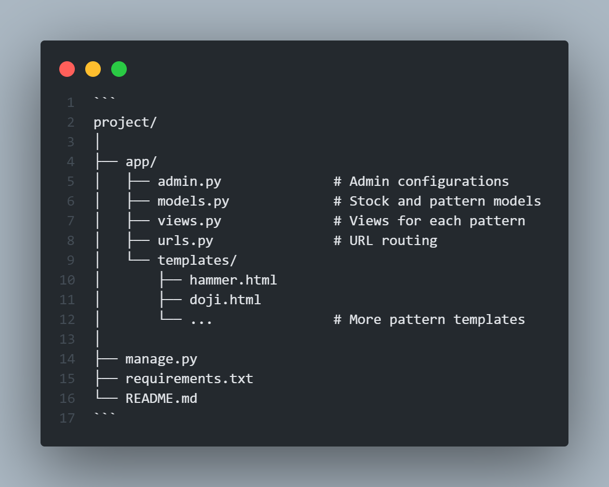

# 📈 Stock Screener with Upstox Integration

This Django project allows users to upload OHLC (Open, High, Low, Close) stock data and visually identify various candlestick patterns such as Hammer, Doji, Engulfing, Kicker, and more. The platform integrates with Upstox for authenticated operations and supports admin-based management of stock data.

Add Nifty500 data using CSV file and via API and used that for fetching OHLC(Open, High, Low, Close) data of stock.

## 📌 Features

✅ Integration with Upstox API for real-time OHLC data.

✅ Detection of **Single Candlestick Patterns**:

    • Hammer / Inverted Hammer
    • Doji
    • Spinning Top / Bottom

✅ Detection of **Double Candlestick Patterns**:

    • Pro Gap Positive
    • Bullish & Bearish Engulfing
    • Bullish & Bearish Kicker

🔒 Upstox authentication integration.

🧩 Modular and extensible Django app structure.

✅ Clean UI built with Django Templates.

✅ Dynamic rendering of results using Django template variables.


## 🛠️ Technologies Used
**Backend**: Django(Python)

**Frontend**: HTML, CSS, Tailwind (with Django templates)

**Database**: SQLite (default, configurable)

**Integration**: Upstox API

**Admin Interface**: Django Admin

## 📁 Project Structure



## 🛠️ Installation

1. **Clone the repository**

    ```bash
    git clone https://github.com/chiraghm12/StockScreener.git
    cd StockScreener
    ```

2. **Create a virtual environment**

    ```bash
    python -m venv venv
    ```

3. **Activate the Virtual Environment**

    * On Windows:

        ```bash
        venv\Scripts\activate
        ```

    * On Mac or Linux

        ```bash
        source venv/bin/activate
        ```

4. **Install the dependencies**

    ```bash
    pip install -r requirements.txt
    ```

5. **Apply Migrations**

    ```bash
    python manage.py makemigrations
    python manage.py migrate
    ```

6. **Create a superuser**

    ```bash
    python manage.py createsuperuser
    ```

6. **Start the Django server**

    ```bash
    python manage.py runserver
    ```

## 📊 Admin Panel
* Navigate to /admin/ and log in with your superuser credentials.

* Upload stock data and view pattern detections.

* Patterns are identified and shown on their respective URLs.

## ⚙️ Environment Configuration

Create a *.env* file (or similar secure method) to store:

    DEBUG=True
    CLIENT_ID=<your_client_id>
    CLIENT_SECRET=<your_client_secret>
    REDIRCT_URL=<redirect_url>
    ACCESS_TOKEN_URL=<access_token_url>


## 📄 License

This project is licensed under the MIT License.

## 📸 Screenshots

Home Screen


Candle Stick Patterns


E.g. Hammer


Upstox Authorization


## 🙏 Acknowledgement

This project was made possible through the use of the following tools and platforms:
* **Django** – for providing a robust and scalable backend web framework.
* **Tailwind CSS** – for enabling rapid and responsive frontend development with utility-first CSS.
* **Upstox API** – for access to real-time and historical market data, essential for candlestick pattern detection.
* **The open-source community** – for continuous innovation, resources, and support throughout development.


## ⚠️ Disclaimer

**This project is for educational and informational purposes only.**

* It does not provide financial or investment advice.
* The detection of candlestick patterns is based on historical OHLC data, and should not be considered a guarantee of future market behavior.
* Users are responsible for any decisions they make based on the data or patterns shown in this application.
* Always consult with a certified financial advisor or do your own research before making trading or investment decisions.
* This tool should not be used for live trading decisions without thorough testing and validation.
* Use this project responsibly.
